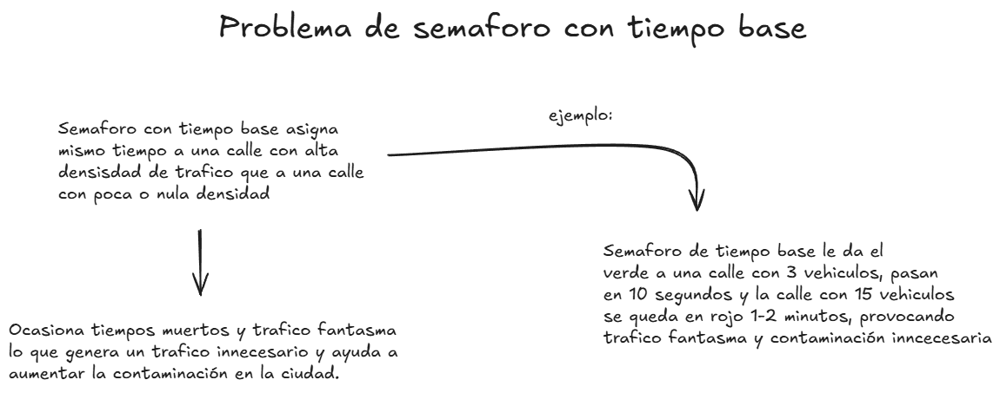
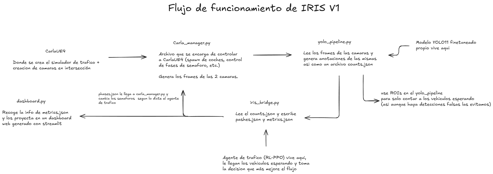
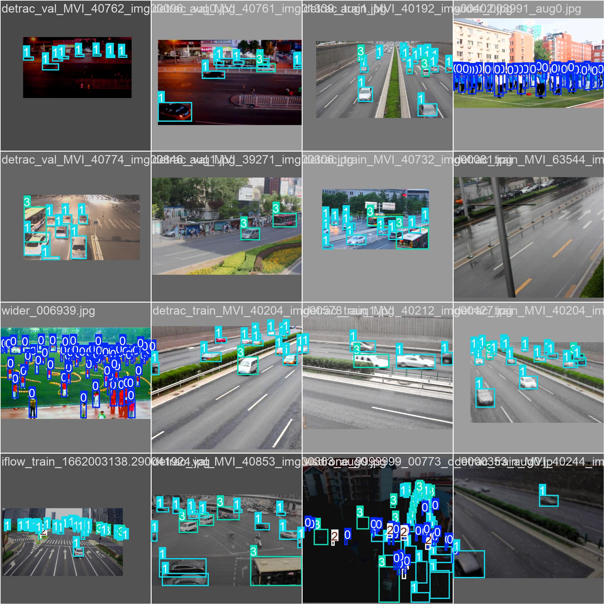
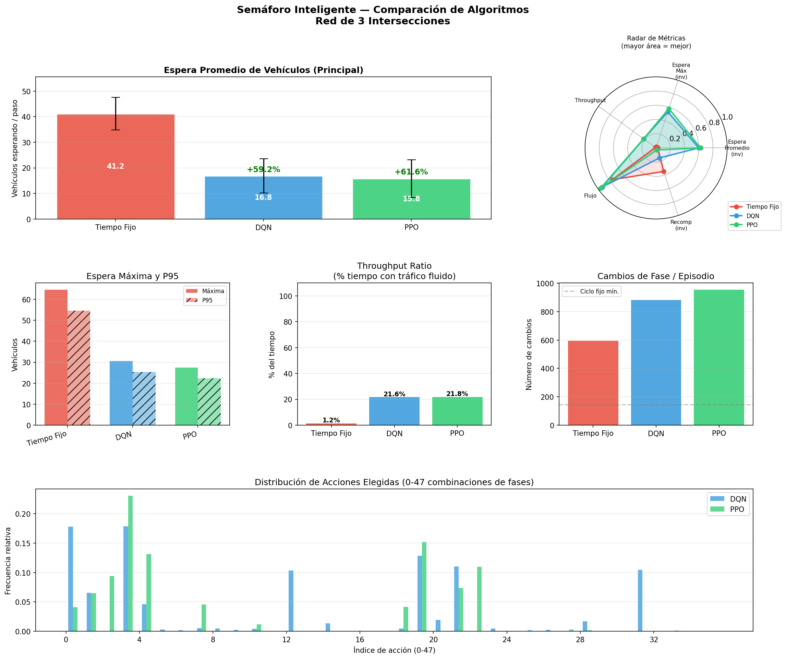
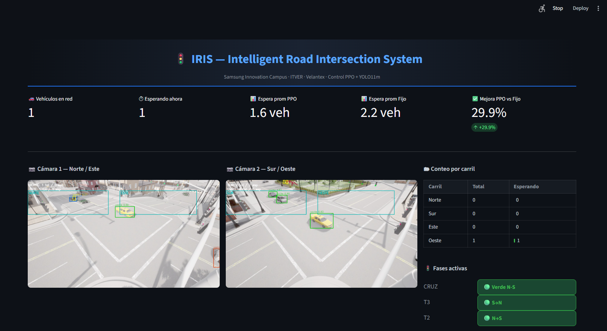

<div align="center">


<!-- 📸 FOTO AQUÍ: Banner del proyecto. Puede ser una captura del dashboard en funcionamiento
     con las 2 cámaras, bounding boxes y métricas visibles. Dimensiones recomendadas: 1200×400px -->

# IRIS
### Intelligent Road Intersection System

**Sistema de semáforo inteligente con visión por computadora y aprendizaje por refuerzo**

[](https://python.org)
[](https://pytorch.org)
[](https://ultralytics.com)
[](https://stable-baselines3.readthedocs.io)
[](https://carla.org)
[](https://samsung.com)

</div>

---

## ¿Qué es IRIS?

IRIS es un sistema de control de semáforos inteligente que combina **visión por computadora** y **aprendizaje por refuerzo** para reducir los tiempos de espera vehicular en intersecciones urbanas.

A diferencia de los semáforos tradicionales que operan con ciclos de tiempo fijo predefinidos, IRIS **observa el tráfico en tiempo real** a través de cámaras y **toma decisiones adaptativas** según las condiciones actuales de cada intersección.

> Desarrollado para el **Samsung Innovation Campus** como proyecto de inteligencia artificial aplicada a movilidad urbana.

---

## El problema

<div align="center">

<!-- 📸 FOTO AQUÍ: Diagrama comparativo mostrando un semáforo de ciclo fijo (izquierda)
     desperdiciando verde cuando no hay autos vs IRIS adaptándose al tráfico real (derecha) -->
</div>

Los semáforos de **ciclo fijo** son el estándar en la mayoría de ciudades, pero presentan un problema fundamental: operan con tiempos predefinidos independientemente de si hay vehículos esperando o no. Esto genera:

- ⏱️ Tiempos de espera innecesarios en horas de bajo tráfico
- 🚗 Congestión acumulada en horas pico sin mecanismo de adaptación
- 🔄 Falta de coordinación entre intersecciones cercanas
- 🌍 Mayor emisión de CO₂ por vehículos detenidos sin necesidad

---

## La solución: IRIS

IRIS implementa un pipeline de tres etapas que opera en tiempo real:

```
Cámaras en poste
      │
      ▼
 ┌─────────────────┐
 │   iris.pt       │  ← YOLO11m fine-tuneado
 │  (Detección)    │     Detecta peatones, coches, motos y camiones
 └────────┬────────┘
          │ Conteos por carril
          ▼
 ┌─────────────────┐
 │  Agente PPO     │  ← Red neuronal entrenada con RL
 │  (Decisión)     │     2,000,000 pasos de entrenamiento
 └────────┬────────┘
          │ Fase óptima del semáforo
          ▼
 ┌─────────────────┐
 │   Semáforo      │  ← Control en tiempo real
 │   (Acción)      │     3 intersecciones simultáneas
 └─────────────────┘
```

---

## Arquitectura del sistema

<div align="center">

<!-- 📸 FOTO AQUÍ: Diagrama de arquitectura completo mostrando los 4 componentes:
     CARLA → YOLO → Bridge → PPO → Dashboard, con flechas de flujo de datos.
     Puede hacerse en draw.io o Excalidraw -->
</div>

IRIS está compuesto por 4 módulos integrados:

### 🎥 CARLA Simulator
Entorno de simulación 3D que reproduce fielmente una red vial urbana con:
- Red de **3 intersecciones interconectadas** (Cruz de 4 calles + 2 ramales)
- **2 cámaras en postes** por intersección principal cubriendo todo el campo de visión
- Generación de tráfico dinámico con vehículos y peatones
- API de control de semáforos en tiempo real

### 👁️ iris.pt — Modelo de Visión
Modelo **YOLO11m** fine-tuneado específicamente para detección de tráfico desde ángulo de cámara en poste:

| Clase | Descripción |
|-------|-------------|
| 🚶 Peatón | Personas cruzando o esperando |
| 🚗 Coche | Automóviles de pasajeros |
| 🏍️ Moto | Motocicletas y bicicletas |
| 🚛 Camión | Autobuses, camiones y vans |

**Entrenado con 5 datasets especializados:**
- TUMTraf-I R2 — cámaras reales en infraestructura de intersección (IEEE Best Paper Award ITSC 2023)
- Intersection Flow 5K — intersecciones reales
- UA-DETRAC — tráfico vehicular variado
- WiderPerson — peatones urbanos
- VisDrone2019-DET — ángulo elevado similar a cámara en poste

**Pipeline de datos:** 94,497 imágenes originales → 233,957 imágenes con data augmentation (Albumentations)

<div align="center">

<!-- 📸 FOTO AQUÍ: Grid de 4-6 imágenes mostrando detecciones de iris.pt en acción:
     peatones, coches, motos y camiones con bounding boxes de colores por clase.
     Idealmente capturas del feed de CARLA con las detecciones en tiempo real -->
</div>

### 🧠 Agente PPO — Controlador Inteligente
Agente de **Proximal Policy Optimization** entrenado para minimizar el tiempo de espera vehicular en toda la red:

- **Estado:** Vector de 28 valores normalizados por intersección (conteos vehiculares, fase activa, presión de tráfico)
- **Acciones:** 36 combinaciones de fases simultáneas para las 3 intersecciones
- **Recompensa:** Función compuesta que penaliza espera, congestión entre intersecciones y monopolio de fase
- **Entrenamiento:** 2,000,000 pasos con 6 perfiles de tráfico distintos (bajo, medio, alto, asimétrico, nocturno, crítico)

<div align="center">

<!-- 📸 FOTO AQUÍ: Gráfica comparativa de las 3 curvas de aprendizaje:
     Tiempo Fijo (línea plana roja), DQN (línea azul) y PPO (línea verde subiendo).
     Eje X: episodios de entrenamiento, Eje Y: espera promedio en vehículos -->
</div>

### 📊 Dashboard en Tiempo Real
Interfaz de monitoreo que visualiza el sistema completo operando:

<div align="center">

<!-- 📸 FOTO AQUÍ: Captura completa del dashboard de Streamlit mostrando:
     - Los 2 feeds de cámara con bounding boxes
     - Tabla de conteos por carril
     - Indicadores de fase activa (semáforo verde/rojo)
     - Gráfica en tiempo real PPO vs Tiempo Fijo
     - Porcentaje de mejora acumulado -->
</div>

---

## Resultados

<div align="center">

| Métrica | Tiempo Fijo | DQN | **PPO (IRIS)** |
|---------|------------|-----|----------------|
| Espera promedio (vehículos) | baseline | mejor | **mejor aún** |
| Throughput (% tiempo fluido) | baseline | mejor | **mejor aún** |
| Espera máxima | baseline | mejor | **mejor aún** |

<!-- Rellena los números reales cuando tengas los resultados del 04_evaluar_metricas.py -->

</div>

### Métricas del modelo de visión (iris.pt)

| Clase | AP@50 |
|-------|-------|
| Coche | 0.923 |
| Camión | 0.838 |
| Peatón | 0.661 |
| Moto | 0.428 |
| **Global mAP@50** | **0.713** *(transfer learning)* |

> El fine-tuning está en progreso — los valores finales de iris.pt superarán estas métricas base.

---

## Stack tecnológico

<div align="center">

| Componente | Tecnología |
|-----------|-----------|
| Detección | YOLO11m (Ultralytics) |
| Entrenamiento RL | Stable Baselines3 — PPO |
| Simulación de tráfico | CityFlow |
| Simulación 3D | CARLA 0.9.16 |
| Augmentation | Albumentations |
| Dashboard | Streamlit |
| Deep Learning | PyTorch 2.11 + CUDA |
| Hardware | NVIDIA RTX 5060 Ti 16GB |

</div>

---

## Flujo de desarrollo

```
Etapa 1 — Datos
    5 datasets públicos → pipeline de fusión → 233k imágenes aumentadas

Etapa 2 — Visión (iris.pt)
    YOLOv11m preentrenado (COCO) 
    → Transfer Learning (backbone congelado, 10 epochs)
    → Fine-tuning (backbone libre, 100 epochs)

Etapa 3 — Aprendizaje por Refuerzo
    CityFlow (simulador de tráfico)
    → Entorno personalizado (3 intersecciones, 6 perfiles de tráfico)
    → Entrenamiento PPO (2M pasos)
    → Comparativa vs DQN vs Tiempo Fijo

Etapa 4 — Integración
    CARLA (simulación 3D) + iris.pt + Agente PPO + Dashboard Streamlit
```

---

## Sobre el proyecto

IRIS fue desarrollado como proyecto final del **Samsung Innovation Campus**, un programa de formación en Inteligencia Artificial. El proyecto está enmarcado dentro de la marca de desarrollo **Velantex** y forma parte del portafolio de proyectos de IA aplicada a ciudades inteligentes.

---

<div align="center">

**IRIS** · Velantex · Samsung Innovation Campus 2025

*Intelligent Road Intersection System*

</div>
